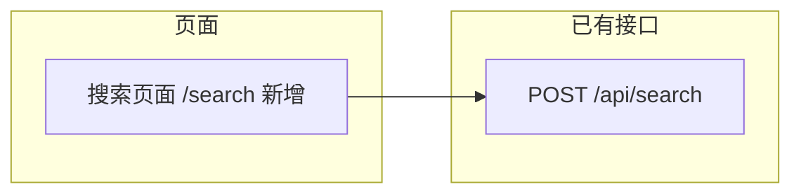

# 统一搜索页面 前端技术方案

## 文档修订历史

| 版本   | 时间       | 修订人    | 说明         |
| ------ | ---------- | --------- | ------------ |
| V0.0.1 | 2026-07-22 | michael.sl | 初始版本     |

---

## 背景和目标

### 需求背景

在 Reflexio docs 前端新增一个调用已有 `POST /api/search` 的统一搜索页面，放在侧边导航栏的首个位置。API 端点已完整实现，支持跨 profiles、agent_playbooks、user_playbooks 三组实体类型的语义/全文/混合搜索。

### 需求理解与澄清结论

- 后端 `POST /api/search` 完整就绪，返回 `UnifiedSearchViewResponse`（含 `profiles`、`agent_playbooks`、`user_playbooks`、`reformulated_query` 等字段）
- 前端只需新增一个搜索页面 + API 客户端层，不需要修改后端
- 侧边栏需要新增 "Search" 导航链接并放在首位
- 页面模式参照 sessions 页面：`page.tsx` + `use-search-data.ts` Hook
- 现有类型 `ProfileView`、`AgentPlaybookView`、`UserPlaybookView` 已定义，可直接复用
- 需要新增 `UnifiedSearchViewResponse` 类型到 `types.ts`

---

## 开发目标与验收契约

### 开发目标

| ID   | 可观察的交付结果 | 来源 |
| --- | --- | --- |
| G-1 | 侧边栏第一项为 "Search"（中文"搜索"），点击跳转到 `/search` 页面 | 用户需求 |
| G-2 | `/search` 页面包含搜索输入框和查询按钮，输入 query 点击搜索后调用 `POST /api/search`，展示三组结果（Profiles、Agent Playbooks、User Playbooks） | 用户需求 |
| G-3 | 搜索页面处理加载中、空结果、错误三种状态，保持与其他页面一致的 UI 风格 | 既有页面一致性 |

### 验收标准

| ID | 关联目标 | 可验证标准 | 验证方式 |
| --- | --- | --- | --- |
| AC-1 | G-1 | GIVEN 文档站加载 WHEN 查看侧边栏 THEN 首项为 Search 链接（中文环境显示"搜索"），图标为 Search(lucide)，点击跳转到 `/search` | 构建 + 浏览器验证 |
| AC-2 | G-2 | GIVEN 在 `/search` 页面 WHEN 输入 query "test" 并点击搜索 THEN 调用 `POST /api/search`，返回结果显示在三个分组卡片中（Profiles、Agent Playbooks、User Playbooks），每组显示结果数量和前 top_k 条内容摘要 | 构建 + 浏览器验证 |
| AC-3 | G-2 | GIVEN 搜索结果中有 `reformulated_query` WHEN 渲染结果 THEN 页面显示改写后的查询提示 | 构建验证 |
| AC-4 | G-3 | GIVEN 搜索请求进行中 WHEN 等待响应 THEN 显示 loading 状态（骨架屏或 spinner） | 构建验证 |
| AC-5 | G-3 | GIVEN 搜索请求失败 WHEN 渲染页面 THEN 显示红色错误提示 banner | 构建验证 |
| AC-6 | G-3 | GIVEN 搜索返回空结果（所有三组均为空数组）WHEN 渲染页面 THEN 显示"无结果"提示，不显示空分组卡片 | 构建验证 |

### 覆盖与例外

- 来源 -> `G-1` -> `AC-1` -> 侧边栏修改（`sidebar.tsx`）
- 来源 -> `G-2` -> `AC-2`, `AC-3` -> 搜索页面（`app/search/page.tsx`） + API 客户端（`lib/search-api.ts`）
- 来源 -> `G-3` -> `AC-4`, `AC-5`, `AC-6` -> 搜索页面状态处理
- 排除项及理由：
  - 搜索参数 `top_k`、`threshold`、`entity_types`、`search_mode` 等高级选项：首次实现限制为基础搜索框，保持 UI 简洁；后续迭代可扩展高级筛选面板
  - `enable_reformulation`、`enable_agent_answer`、`conversation_history` 等高级功能：需要 LLM 调用，首次实现跳过
  - `search_mode` 选择器：首次默认使用 `hybrid`，暂不暴露切换 UI
- 暂时无法覆盖的高风险项及处理方式：无

---

## 涉及仓库

| 仓库 ID | 本地路径 | 类型 | 本次变更摘要 |
| ------- | -------- | ---- | ------------ |
| reflexio-docs | ./docs | frontend/Next.js | 新增 /search 页面、API 客户端、类型、i18n；修改侧边栏导航 |

---

## 总体设计

### 页面架构

| 页面 | 路由路径 | 类型 | 核心功能 |
| --- | --- | --- | --- |
| 搜索页面 | /search | 新增 | 统一搜索入口：输入 query → 调用 /api/search → 三栏分组展示结果 |

### 接口依赖图

### 状态管理设计

沿用项目已有方案：React `useState` + `useEffect` 自定义 Hook 模式（与 sessions 页面一致）。无跨页面状态共享需求，不使用 Zustand。

---

## 详细设计

### 目标与设计映射

| Goal / AC | 设计章节或代码落点 | 关键决策 |
| --- | --- | --- |
| G-1 / AC-1 | `sidebar.tsx` — 在现有导航列表最前面添加 Search 链接 | 使用已有 `Search` (lucide) 图标，遵循现有 Link 样式模式 |
| G-2 / AC-2 | `app/search/page.tsx` + `lib/search-api.ts` — 搜索表单 + 结果展示 | 默认 `top_k=5`, `search_mode="hybrid"`, `threshold=0.3`；三组结果各自用卡片分组 |
| G-2 / AC-3 | `app/search/page.tsx` — reformulated_query 提示 | 在结果顶部展示浅色提示条 |
| G-3 / AC-4/5/6 | `app/search/page.tsx` — loading/error/empty 状态 | 沿用 sessions 页面的状态处理模式 |

### 页面清单

#### 搜索页面 /search

**核心交互**：
1. 用户进入页面，看到一个居中的搜索输入框和搜索按钮
2. 输入 query，点击搜索（或按 Enter）
3. 页面显示 loading 状态，调用 `POST /api/search`
4. 返回后展示三组结果卡片（Profiles、Agent Playbooks、User Playbooks）
5. 每组卡片显示结果条数和简要内容（名称、ID、状态等关键字段）
6. 如查询被改写，显示 reformulated_query 提示

**状态管理**：
- Hook: `useSearchData(apiEndpoint)` — 管理 query、results、loading、error 状态
- 关键状态: `query`, `results` (UnifiedSearchViewResponse | null), `loading`, `error`

**关键组件**：

| 组件 | 职责 | Props |
| --- | --- | --- |
| `SearchPage` | 页面主体：搜索框 + 结果展示 | 无 |
| `ResultGroup` | 单个实体类型的结果分组卡片 | `title`, `items`, `renderItem` |

**API 客户端** (`lib/search-api.ts`)：

- `fetchUnifiedSearch(apiEndpoint, payload)` — 调用 `POST /api/search`，返回 `UnifiedSearchViewResponse`

**类型定义** (`lib/types.ts`)：

- 新增 `UnifiedSearchViewResponse` 接口：`{ success, profiles, agent_playbooks, user_playbooks, reformulated_query, msg, agent_trace, rehydrated_text }`

### 修改点清单

| 文件 | 操作 | 说明 |
| --- | --- | --- |
| `docs/app/search/page.tsx` | **新增** | 搜索页面主体组件 |
| `docs/app/search/use-search-data.ts` | **新增** | 搜索数据 Hook |
| `docs/lib/search-api.ts` | **新增** | API 客户端 |
| `docs/lib/types.ts` | **修改** | 新增 `UnifiedSearchViewResponse` |
| `docs/components/layout/sidebar.tsx` | **修改** | 在导航列表最前面添加 Search 链接 |
| `docs/lib/i18n/locales.ts` | **修改** | nav 新增 `search` 键；新增 `searchPage` 块 |
| `docs/lib/i18n/en.ts` | **修改** | 添加英文翻译 |
| `docs/lib/i18n/zh.ts` | **修改** | 添加中文翻译 |

---

## 校验规则

| 校验项 | 级别 | 处理 |
| --- | --- | --- |
| 页面无路由路径 | **P0** | 阻断 — 需定义 `/search` |
| 缺少 i18n 键值 | **P0** | 阻断 — 需三文件同步添加 |
| 类型定义缺失 | **P0** | 阻断 — 需在 types.ts 定义 |
| API 客户端无错误处理 | 警告 | 需 try/catch 并返回 error 消息 |

---

## 实现计划

| Stage | 关联目标 / AC | 任务 | 依赖 |
| --- | --- | --- | --- |
| 1 | G-1,G-2,G-3 / AC-1..AC-6 | TypeScript 类型定义 + i18n 词条 | 无 |
| 2 | G-2,G-3 / AC-2..AC-6 | API 客户端 (`search-api.ts`) + 数据 Hook (`use-search-data.ts`) | Stage 1 |
| 3 | G-1 / AC-1 | 侧边栏修改（Search 链接置顶） | 无 |
| 4 | G-2,G-3 / AC-2..AC-6 | 搜索页面组件 (`app/search/page.tsx`) | Stage 2 |
| 5 | G-1..G-3 / AC-1..AC-6 | 构建验证 (`npm run build`) | Stage 1-4 |

---

## 测试场景组

| 关联 AC | 测试场景组 | 测试内容 | 预期结果 | 优先级 |
| --- | --- | --- | --- | --- |
| AC-1 | 侧边栏渲染 | 加载页面，验证 Search 链接在侧边栏首位，中英文切换正常 | Search 作为第一项，切换语言后显示对应文本 | P0 |
| AC-2 | 搜索成功 | 输入 "test"，点击搜索 | 调用 API 成功，三组结果正确展示，每组显示条数 | P0 |
| AC-4 | 加载状态 | 点击搜索后 | 显示 loading 状态，响应返回后消失 | P0 |
| AC-5 | 错误状态 | 断开后端或使用无效 endpoint | 显示红色错误提示，不崩溃 | P0 |
| AC-6 | 空结果 | 搜索一个无匹配的 query | 显示"无结果"提示，不显示空分组 | P1 |

---

## 附录 - 参考文档

- 后端搜索接口：`reflexio/server/routes/search.py` — `POST /api/search`
- 响应 Schema：`reflexio/models/api_schema/retriever_schema.py` — `UnifiedSearchViewResponse`
- 参考页面模式：`docs/app/sessions/page.tsx` + `use-sessions-data.ts`
- i18n 模式：`docs/lib/i18n/locales.ts`, `en.ts`, `zh.ts`